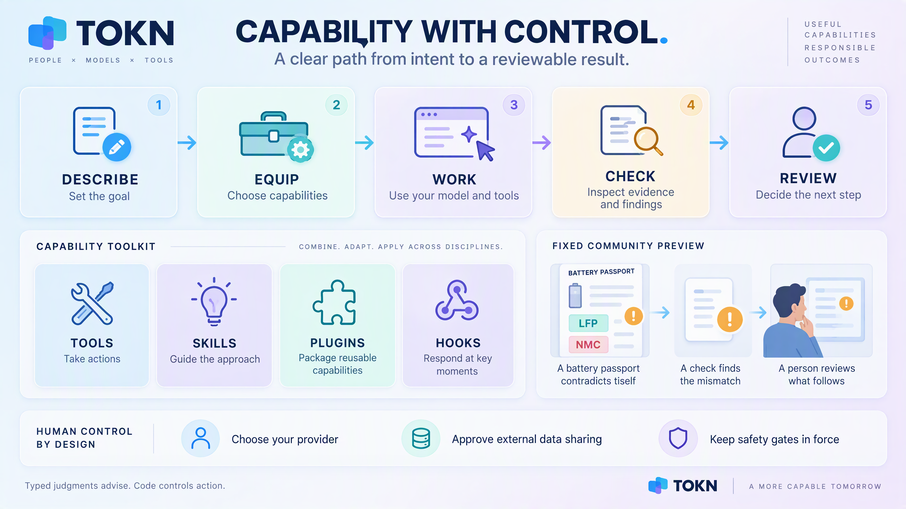
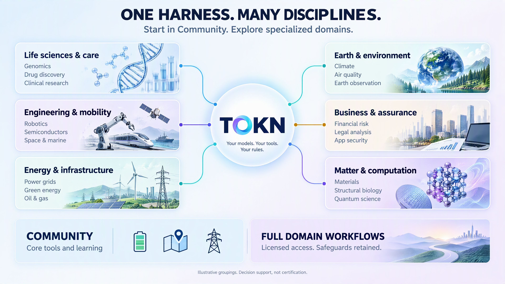

# TOKN — download & try

**TOKN** is a trust-first agentic coding and reasoning harness: a single static
binary with 20+ regulated-domain plugs, offline licensing, and in-place
self-update. This repo hosts **the binaries only** so you can try TOKN — the
source lives in a private repository.

---

## Why TOKN? Value for teams running agents in production

Most agents look great in a demo and get fragile in production. TOKN is the
**harness around the model** — the part that makes an agent *reliable, safe, and
honest about its own quality*. A few concrete ways it adds value, in plain terms:

- **Self-improvement that can't fool itself.** Agents that tune themselves often
  push one number up while the real goal quietly gets worse.
  *Example: a support bot's "tickets resolved" climbs because it learned to close
  hard tickets fast — while renewals fall.* TOKN's **Graph of Loops** wraps the
  optimizing loop in governance loops and ties every change to **anchors** (real
  outcomes, a frozen held-out test set, human judgment). A change ships **only if
  every anchor agrees.** → `tokn loopgraph` · `/learn loopgraph`

- **Measure quality, then fix it — on a loop.** You can't improve what you don't
  score. *Example: you suspect your agent "sometimes invents a citation." TOKN
  turns that worry into a countable metric, grades a batch of runs, applies a fix,
  and re-grades — and blocks any change that regresses your baseline.*
  → `tokn flywheel` · `/learn flywheel`

- **Hard guardrails for regulated work.** In medicine, finance, or legal,
  "usually right" isn't good enough. *Example: a precision-medicine gate blocks a
  high-risk drug–gene recommendation from ever being emitted; a finance gate
  enforces the required disclaimer language before an answer leaves the agent.*
  20+ domain plugs ship these gates and validators, and you can encode your own
  thresholds. → see **Domain harnesses** in [CAPABILITIES.md](CAPABILITIES.md)

- **Local workflows that can be prepared for an air gap.** Tabular prediction
  uses explicit local data and pre-staged model files, with no runtime model
  downloads. For agent workflows, select a local model and `--air-gap`; cloud
  models necessarily send their inputs to the configured provider. Disable
  unrelated install registration and update checks with `TOKN_NO_REGISTER=1`
  and `TOKN_NO_UPDATE_CHECK=1`. Enforce network isolation at the host boundary
  when required; runtime settings are not an OS sandbox.

- **Customize without waiting for a vendor.** Every prompt is a file, not baked-in
  code. *Example: a new model lands that follows instructions differently — you
  tune behavior by editing `.nospace/prompts/…`, no recompile and no release.*
  → `/learn customize`

**See it clearly:** `tokn config doctor` shows exactly which config files and env
vars are in effect (secrets redacted); `tokn introspect` prints a machine-readable
capability contract.

**Learn more:** the full tour is in **[CAPABILITIES.md](CAPABILITIES.md)**. Inside
a session, `/learn` opens an interactive lesson for any concept above
(e.g. `/learn loopgraph`), and `tokn --help` is always the authoritative,
version-accurate catalog.

---

> Start here: download for your OS → **verify the signature** → put it on your
> `PATH` → try the **[Community quick start](#community-quick-start--no-trial-required)**.
> A trial is optional for premium features.
>
> Prefer a guided, copy-paste walkthrough? **[GETTING_STARTED.md](GETTING_STARTED.md)**
> takes you from a fresh download to three runnable domain previews and a full
> offline governed-judgment example, with the expected output printed for each
> step — no API key and no trial.
>
> ⚠️ **Platform note — Apple Silicon.** **Developer-license support is not ready on
> Apple Silicon (macOS arm64).** See [Platform support](#platform-support) before you
> download.

> Curious what it does? See **[CAPABILITIES.md](CAPABILITIES.md)** for a quick tour —
> or just run `tokn --help` after installing.

> ✨ **Graph of Loops.** A single self-improvement loop can optimize
> the wrong thing (raise a metric while the real goal quietly degrades). TOKN lets
> one TOKN act as an **outer-loop custodian** over another: an optimizing loop wrapped
> by governance loops and grounded by **anchors** (real outcomes, frozen held-out
> rules, human judgment). A win is accepted **only if every anchor agrees** —
> improvement that can't fool itself. Try `tokn loopgraph` or `/learn loopgraph`.

> 🧾 **The Design-Loop Card.** Every `autodesign` / `autoresearch` run now
> emits a portable card that records *how* a result emerged (bounds, evaluator
> feedback, held-out check, rejected-candidate graveyard) — and a **fail-closed
> verdict**. A win selected only by the in-loop evaluator is an honest
> *unconfirmed-win*, never a contribution; **only a held-out-confirmed win is
> reportable**. It catches the "simulator escape" (beating a benchmark by exploiting a
> weakened evaluator) instead of shipping it.

> 🔑 **Bring your own model.** TOKN needs an LLM provider (OpenAI, Azure OpenAI,
> Anthropic/Claude, Gemini, or a local runtime). See **[SETUP.md](SETUP.md)** to
> configure your provider and API key in under a minute.

> ⚖️ **Legal:** TOKN is proprietary, evaluation-only software provided **"as is",
> with no warranty and no liability**. It may **not** be copied, redistributed, or
> reverse-engineered — **including any attempt to extract, reconstruct, or retrain
> on its internals with AI/LLM tools**. Cloning or downloading this repo grants you
> **no** such rights. This is a **feedback-first program**: providing feedback is a
> **condition** of the trial. AI output is not professional advice and must be
> verified; you are responsible for compliance and assume all risk. By downloading,
> cloning, or using TOKN you agree to the **[License & Disclaimer](LICENSE.md)** —
> please read it.

---

## Local prediction — models beyond chat

Community users can build classifiers and regressors without a trial or API key:

```sh
tokn tabular scaffold --dir delivery-demo --example delivery
tokn tabular inspect --root delivery-demo
tokn tabular doctor --root delivery-demo
tokn tabular evaluate --root delivery-demo
tokn tabular predict --root delivery-demo
```

The starter is a small **synthetic example**, not a production benchmark.
Also try `maintenance` or `repair-cost`. Baseline execution needs Python 3.11+
with no extra packages. Inspection and scaffolding need only TOKN.

Optional **NVIDIA Kumo-Tabular** uses locally staged dependencies and hashed
classifier/regressor weights. Even the large checkpoints are individually under
1 GB (~855 MB and ~863 MB); both together, dependencies and RAM/VRAM need more
capacity. Nothing is installed or downloaded automatically.

The agent can create the workflow and explain evaluation; the predictor computes
the outputs. Probabilities and regression intervals are not proof of calibration
or permission to act. Numerical/categorical CSV is supported; automatic text
features and remote serving are not.

See **[TABULAR.md](TABULAR.md)** for offline preparation, model selection and
agent tools. In the REPL, `/learn tabular` explains the same workflow.

## Platform support

| OS | Architecture | Asset | Community tier | Developer-license activation |
|----|--------------|-------|----------------|------------------------------|
| Windows | x64 | `tokn_windows_amd64.exe` | supported | supported |
| Linux | x86_64 | `tokn_linux_amd64` | supported | supported |
| Linux | arm64 | `tokn_linux_arm64` | supported | supported |
| macOS | Intel | `tokn_darwin_amd64` | supported | supported |
| macOS | Apple Silicon | `tokn_darwin_arm64` | supported | **not ready** |

**Developer-license support is not ready on Apple Silicon (macOS arm64).** The
`tokn_darwin_arm64` download is available for Community use. The
[Community quick start](#community-quick-start--no-trial-required), including
the domain previews and offline judgment examples, needs no developer licence.
That download does not imply developer-license readiness or a workaround for it.
This is a readiness notice, not a diagnosis of a particular activation failure.

Two things follow from that, and we would rather say them plainly than let you
discover them:

- **Do not spend your trial on an Apple Silicon Mac.** The trial is limited to
  one per machine. Until developer-license support is ready, use a supported
  platform to evaluate licensed features instead.
- **This is about Apple Silicon specifically, not macOS.** macOS on Intel is
  fully supported, licensing included.

If licensing on Apple Silicon is a blocker for you, say so in an issue — that is
the signal we act on.

## 1. Download

Grab the latest build for your platform from the
**[releases page](https://github.com/bhakthan/tokn-dist/releases/latest)**:

| OS | Architecture | File |
|----|--------------|------|
| Windows | x64 | `tokn_windows_amd64.exe` |
| macOS | Apple Silicon | `tokn_darwin_arm64` |
| macOS | Intel | `tokn_darwin_amd64` |
| Linux | x86_64 | `tokn_linux_amd64` |
| Linux | arm64 | `tokn_linux_arm64` |

Every release also publishes **`SHA256SUMS`** and **`SHA256SUMS.sig`**. Download
them too — you need both for step 2.

The commands below pass **no tag**, so `gh` resolves the current latest release.
Prefer that over pinning a version in a document: a pinned tag in a README goes
stale on the next release and silently hands newcomers an old binary.

**Windows (PowerShell)**
```powershell
gh release download --repo bhakthan/tokn-dist `
  --pattern "tokn_windows_amd64.exe" --pattern "SHA256SUMS*" `
  --dir . --clobber
```

**macOS / Linux**
```bash
gh release download --repo bhakthan/tokn-dist \
  --pattern "tokn_$(uname -s | tr A-Z a-z)_*" --pattern "SHA256SUMS*" \
  --dir . --clobber
```

To pin a specific build instead, insert the tag as the first argument, e.g.
`gh release download v0.3.44 --repo bhakthan/tokn-dist …`. Prefer these URLs
over scraping the releases page: the assets are the artifact, the HTML is not.

## 2. Verify what you downloaded

TOKN is a binary that will run with your permissions on your machine. Verify it.
There are **two independent layers**, and they are not equally strong.

### The release public key

This is the ed25519 public key that signs every TOKN release manifest. It is
published here, in the README, **on purpose** — it has to reach you by a path
other than the download it authenticates:

```
3O2DznsYRy+OU2gTIbpvOfw0O6tUIIRQfiOUDbfoHxo=
```

It is also printed in the release notes of every release. The two should always
agree; if they ever disagree, **stop** and open an issue.

### Layer 1 — the checksum (integrity)

Confirms the bytes arrived intact and match what the release claims.

**Windows (PowerShell)**
```powershell
(Get-FileHash .\tokn_windows_amd64.exe -Algorithm SHA256).Hash.ToLower()
Select-String -Path .\SHA256SUMS -Pattern "tokn_windows_amd64.exe"
# the two hashes must match, character for character
```

**macOS**
```bash
shasum -a 256 -c SHA256SUMS --ignore-missing
```

**Linux**
```bash
sha256sum -c SHA256SUMS --ignore-missing
```

### Layer 2 — the signature (authenticity)

**This is the layer that actually matters.** The checksum alone buys you very
little: anyone who can replace the binary in a release can replace `SHA256SUMS`
in the same breath, and your checksum will match a file they wrote. The
signature is the part they cannot forge without the private key, which is never
in this repo, never in the binary, and never in CI logs.

`SHA256SUMS.sig` is base64 of a raw 64-byte ed25519 signature over the exact
bytes of `SHA256SUMS`. Verify it with OpenSSL — already present on macOS and
Linux, and shipped with Git for Windows at
`C:\Program Files\Git\usr\bin\openssl.exe`:

**Windows (PowerShell)**
```powershell
$ssl = "C:\Program Files\Git\usr\bin\openssl.exe"
$KEY = "3O2DznsYRy+OU2gTIbpvOfw0O6tUIIRQfiOUDbfoHxo="

# wrap the raw key as a PEM SubjectPublicKeyInfo (the prefix is the fixed
# 12-byte ed25519 DER header — it is the same for every ed25519 key)
"-----BEGIN PUBLIC KEY-----`nMCowBQYDK2VwAyEA$KEY`n-----END PUBLIC KEY-----" |
  Set-Content tokn-release.pem -Encoding ascii

# decode the base64 signature to raw bytes
[IO.File]::WriteAllBytes("$PWD\SHA256SUMS.sig.raw",
  [Convert]::FromBase64String((Get-Content SHA256SUMS.sig -Raw).Trim()))

& $ssl pkeyutl -verify -pubin -inkey tokn-release.pem `
  -rawin -in SHA256SUMS -sigfile SHA256SUMS.sig.raw
```

**macOS / Linux**
```bash
KEY=3O2DznsYRy+OU2gTIbpvOfw0O6tUIIRQfiOUDbfoHxo=

printf -- '-----BEGIN PUBLIC KEY-----\nMCowBQYDK2VwAyEA%s\n-----END PUBLIC KEY-----\n' "$KEY" \
  > tokn-release.pem
base64 -d < SHA256SUMS.sig > SHA256SUMS.sig.raw   # macOS: base64 -D

openssl pkeyutl -verify -pubin -inkey tokn-release.pem \
  -rawin -in SHA256SUMS -sigfile SHA256SUMS.sig.raw
```

Expected output — and **nothing else is acceptable**:

```
Signature Verified Successfully
```

Anything else (`Signature Verification Failure`, a non-zero exit code, an
OpenSSL error) means **do not run the binary**. A failure here is not a
formatting problem to work around; it is the check doing its job.

> **Two honest caveats.**
>
> 1. **Do not take the public key from the binary you are verifying.** TOKN
>    compiles this same key in so that `tokn update` can verify future releases,
>    but using it to check the download it came from is circular — a substituted
>    binary would simply carry a substituted key and cheerfully approve itself.
>    Use the key from this README, or from the release notes.
> 2. **`openssl` must not come from the download either.** Use your system's
>    OpenSSL or the one Git installed. This is why the instructions above use a
>    third-party tool rather than a `tokn verify` subcommand — asking an
>    unverified binary whether it is trustworthy is not a security check.
>
> OpenSSL 3.x is required (`-rawin` is how it does ed25519). Check with
> `openssl version`.

### After the first install, this is automatic

You only do the above **once**, for your first download. From then on:

```
tokn update
```

performs *both* layers itself before it will replace the running binary, and it
is **fail-closed** — no bypass environment variable, no `--force`, no "continue
anyway" prompt. It refuses a release with no `SHA256SUMS` at all, and it prints
which layer it applied so you can see whether authenticity was checked or only
integrity.

## 3. Put it on your PATH

**Windows (PowerShell)**
```powershell
Move-Item .\tokn_windows_amd64.exe C:\Tools\tokn.exe
[Environment]::SetEnvironmentVariable("Path", "$env:Path;C:\Tools", "User")
```

**macOS**
```bash
chmod +x tokn_darwin_arm64
sudo mv tokn_darwin_arm64 /usr/local/bin/tokn
```

**Linux**
```bash
chmod +x tokn_linux_amd64
sudo mv tokn_linux_amd64 /usr/local/bin/tokn
```

Verify:
```bash
tokn --version
tokn --help
```

## 4. Point TOKN at a model

TOKN is **bring-your-own-model** — it runs against a provider you already have
(OpenAI, Azure OpenAI, Anthropic/Claude, Gemini, OpenRouter, Fireworks) or a local
runtime (Ollama, llama.cpp/GGUF, ONNX). It even drives **computer-use** models —
Microsoft's **Fara1.5** (via `tokn fara-run`, with a real coordinate browser) and
**MagenticBrain**. Set two variables plus your key, e.g.:

```bash
export NOSPACE_MODEL_PROVIDER=openai
export NOSPACE_MODEL_NAME=gpt-4o
export OPENAI_API_KEY=sk-...
tokn auth status        # confirms the provider is configured & ready
tokn config doctor      # see every config file & env var TOKN picks up (secrets redacted)
```

Prefer a file? Drop the same keys in a `.env` in your working directory (TOKN
auto-loads it, non-overriding — just keep it out of git). **Full provider matrix,
Azure `az login` auth, and local-model setup: [SETUP.md](SETUP.md).**

## Community quick start — no trial required

Available in **v0.3.44 and later**. After installing and verifying TOKN, these
features work in the free Community tier. No trial activation, no API key, no
model provider and no embedded wiki is required. Specialized domain *workflows*
remain separately licensed — what is free is described precisely below.

**Step-by-step version with expected output for every command:
[GETTING_STARTED.md](GETTING_STARTED.md).**

### Three domain previews you can run right now

Each preview feeds a small **fixed synthetic case** to a **real TOKN domain
validator** — the same exported function the licensed domain plug calls — and
prints what it decided. One case is accepted, one is blocked, and the blocked
case shows the finding text the validator actually produced.

```text
tokn community list
tokn community demo --domain powergrid
tokn community demo --domain geospatial
tokn community demo --domain batterypass
```

To run all three plus the offline judgment walkthrough in one unattended pass,
this repository also ships `scripts/community-smoke.sh` (bash) and
`scripts/community-smoke.ps1` (PowerShell). Each needs only the `tokn` binary,
works in a temp directory it deletes on exit, and exits `0` only if every check
passed.

| Preview | The question it answers |
|---------|-------------------------|
| `powergrid` | After a single-element outage, is every bus still inside the NERC TPL-001-5 N-1 voltage band? |
| `geospatial` | Is this coordinate reference system valid for computing **area**, or will the number be plausible and wrong? |
| `batterypass` | Does the chemistry declared on an EU Battery Passport agree with the cathode formula declared in the same document? |

Add `--json` to either command for machine-readable output.

**What a preview is, honestly.** It computes locally, reads no file you supply,
writes nothing to disk, makes no network call of its own, activates no domain and
registers no domain tool — the inputs are compiled in, which is exactly why it is
free and safe to run anywhere. (TOKN's startup does its usual licence lookup and
may record a one-time anonymous install count or check for a newer release;
`TOKN_NO_REGISTER=1` and `TOKN_NO_UPDATE_CHECK=1` switch those off — see
[GETTING_STARTED.md](GETTING_STARTED.md).) It shows you *that a check exists and
what it decides*. The
licensed domain adds the lifecycle state machine, the full validator set, the
gates that block state transitions, the tool surface and the subagents. Preview
output is a decision-support illustration on synthetic data — **not**
engineering, regulatory, clinical or compliance advice.

### Offline governed judgments

Governed judgments separate typed model interpretation from deterministic policy.
They are advisory recommendations — never permission to execute a tool or bypass
a gate.

```text
tokn judgments example
tokn judgments evaluate --help
```

`judgments example` prints a local rules bundle to stdout; it runs no evaluation
and writes no file. `judgments evaluate` takes explicit bundle and request files;
with the `rules` provider and `--air-gap` it evaluates entirely offline, with no
model call. **A complete worked example — bundle, request, a passing run and a
failing run, with the exact output of each — is in
[GETTING_STARTED.md](GETTING_STARTED.md#3-governed-judgments-offline-no-key).**

### Optional: try a Jev decision model

Use your own Jev API key. `status` checks configuration without calling the decision
API. **Running `triage` sends the supplied task text to Jev and may incur provider
charges.** Use synthetic or approved text, never secrets or unapproved sensitive data.

**Windows (PowerShell)**
```powershell
$env:JEV_API_KEY = "YOUR_KEY"
tokn system-one status
tokn system-one triage --text "Add a unit test for trimming spaces"
```

**macOS / Linux**
```bash
export JEV_API_KEY="YOUR_KEY"
tokn system-one status
tokn system-one triage --text "Add a unit test for trimming spaces"
```

Keep keys out of source control. This triage example returns an advisory assessment;
it does not edit code or run tools. For multiple typed questions over the same state,
`tokn system-one evaluate` asks all of them against one explicitly supplied
state. (That is not the same as `tokn system-one batch`, which runs *independent*
states with bounded parallel calls.) Use `tokn system-one evaluate --help` for
the explicit input-file interface.

### Optional: the bundled `decision-models` skill pack

TOKN embeds a skill pack adapting TypeSafe's MIT-licensed agent skill — bounded
decision design, structured state, batching independent work, keeping the final
policy deterministic. It is **in the public binary**: no npm, no SDK, no GitHub
token, no network call.

```bash
tokn plugin install decision-models
```

It installs under your TOKN home (`~/.tokn/plugins/`), never into your repository,
and is **instructions only** — no tools, no hooks, no agents. Inside an agent
session, `/skill inspect tokn-decision-models:typesafe-ai-decisions` shows the
summary and `/skill invoke ...` prints the full instruction text. Both only
print — despite the name, `invoke` does not start a task; read it, then make
your request in your own words, which runs on your model at your own cost. Full
walkthrough: **[GETTING_STARTED.md](GETTING_STARTED.md#6-optional-the-decision-models-skill-pack)**.

### Developer path: tools, skills, hooks, permissions

Four different things separated by a permissions boundary: a **tool** executes, a
**skill** is only instructions, a **hook** runs your command with your
permissions, and **trust** decides what is offered at all. The on-ramp is built
into the binary:

```bash
tokn community guide     # or just: tokn community
```

Discover them first — no key, no licence, all offline:

```bash
tokn agent-tools --mcp-disabled   # tools available right now
tokn plugin catalog               # installable skill packs and plugins
tokn plugin list                  # what is already visible
tokn doctor --list                # providers and how to connect one
```

Then inspect inside `tokn agent-repl` (`/skill list`, `/hooks list`,
`/permissions show`, `/trust audit`) before enabling anything. Those commands
only report configuration — `/hooks list` in particular does not tell you which
hooks are live, and a workspace hook additionally needs
`tokn trust --capability hooks` plus a restart before it will run. Full path,
including a safe prompt-customization example:
**[GETTING_STARTED.md](GETTING_STARTED.md#7-developer-path-tools-skills-hooks-permissions)**.

### Learn without the wiki

The public download excludes the embedded wiki, **not the built-in lessons or these
Community features**. Inside a configured `tokn agent-repl` session, run:

```text
/learn system-one
/learn judgments
/learn decision-models
```

These explain typed decisions, shared-state batching, and governed judgments.
Configure a generative LLM using [SETUP.md](SETUP.md) for agent sessions;
the standalone Jev example above needs only Jev credentials, not an LLM key.
The domain previews and the offline judgment examples need neither.

---

## What TOKN is made of — concepts and commands

[](docs/assets/community-depth.png)
*From intent to a reviewable result. The battery-passport example is a fixed
Community preview, not a production approval. Click for the full 4K image.*

Most of TOKN is one of six things. They are genuinely different in what they can
*do to your machine*, which is why they have separate commands and a separate
permissions boundary. This table is the map; the walkthrough is
[GETTING_STARTED.md](GETTING_STARTED.md#7-developer-path-tools-skills-hooks-permissions).

Two places to type. **[shell]** is your normal terminal. **[repl]** is inside an
agent session you started with `tokn agent-repl`, which needs a configured model
([SETUP.md](SETUP.md)). Everything marked [shell] below works with no model, no
key and no licence.

| Concept | What it actually is | Discover | Inspect | Use / enable |
|---|---|---|---|---|
| **Tool** | An executable function with a typed schema that the model may call during a session. Runs code. | `tokn agent-tools --mcp-disabled` [shell] | same command prints each schema | offered automatically in a session, subject to your permissions and approval prompts |
| **Skill** | Reusable instructions, with optional supporting files; actions still use the session's tools and permissions. | `/skill list` [repl] | `/skill inspect <id>` (metadata) [repl] | `/skill invoke <id>` **prints** the text [repl]; then make your request in your own words. `invoke` does not start a task |
| **Plugin / pack** | An installable bundle that *carries* skills (and, for some packs, more). | `tokn plugin catalog` [shell] | `tokn plugin list` [shell] | `tokn plugin install decision-models` [shell] — installs to `~/.tokn/plugins/`, never into your repo |
| **Hook** | A lifecycle callback that runs **your shell command** with **your** permissions at an agent event. | `/hooks list` [repl] — configuration only, not proof a hook is live | `/hooks test` is an alias of `/hooks list`: both validate the settings files and execute nothing [repl] | `/hooks add PreToolUse <command>` writes config [repl]; it does **not** activate it. Also needs `tokn trust --capability hooks <path>` [shell] and a restart |
| **Lesson** | Built-in explanations of TOKN's own ideas, shipped in the binary. | `/learn` lists every topic [repl] | — | `/learn judgments`, `/learn system-one`, `/learn decision-models` [repl] |
| **Preview** | A fixed synthetic case run through a real domain validator. | `tokn community list` [shell] | `--json` adds a machine-readable form | `tokn community demo --domain <name>` [shell] |

And four things that control the rest:

| Control | What it decides | Commands |
|---|---|---|
| **Trust** | Whether a workspace may use hooks, MCP servers, command expansion or prompt overrides at all. Nothing is granted implicitly. | `tokn trust status` / `tokn trust --capability hooks <path>` [shell]; `/trust audit` [repl] |
| **Permissions** | Which paths and operations a session may touch. | `/permissions show` [repl] |
| **Model config** | Which provider and model a session uses, and what it costs you. | `tokn doctor --list` [shell]; `/model`, `/models` [repl] |
| **Custom instructions** | Prompt text is data: mode and domain prompts are files you can replace without rebuilding. | write `~/.tokn/prompts/mode-<name>.md`, then `/mode <name>` [repl]. Project-level overrides require the `prompts` trust capability, so a cloned repo cannot quietly rewrite the agent's instructions |

**Typed decisions** are the idea underneath several of these: instead of asking a
model for prose and parsing hope out of it, you define the verdicts up front and
get a structured answer back. Two surfaces ship in the free tier —
`tokn judgments` (rules provider, fully offline, advisory only) and
`tokn system-one` (typed questions over one shared state) — plus the
`decision-models` skill pack, which teaches the design pattern. See
[Offline governed judgments](#offline-governed-judgments) above.

Three boundaries worth stating plainly, because they are easy to assume wrong:

- **Installing is not enabling.** Installing `decision-models` adds instructions,
  not executable domain access or permission grants.
  Adding a hook writes configuration, and the hook still does not run until you
  grant that workspace the `hooks` capability and restart.
- **Printing is not running.** `/skill invoke` and `/hooks test` both only
  report; neither executes anything (`/hooks test` is the same command as
  `/hooks list`). `/hooks list` shows what is *configured*, which is not the
  same as what is *loaded*.
- **Free is not silent.** The previews, `tokn judgments` with the rules provider,
  the lessons and all the discovery commands above need no key, no licence and no
  network. TOKN's own startup is separate: it resolves your licence file, counts
  the install once and checks for updates daily. Set `TOKN_NO_REGISTER=1` and
  `TOKN_NO_UPDATE_CHECK=1` to turn those two off. Anything that calls a model —
  an agent session, a Jev evaluation — runs on your credentials at your cost.

---

## What full domain access adds

[](docs/assets/community-breadth.png)
*Breadth without hidden access promises: Community includes fixed battery-passport,
geospatial and power-grid previews. Specialized workflows retain their licensing
and safeguards. Click for the full 4K image. [Image sources](docs/assets/README.md).*

A **domain harness** adds field-specific tools, validators, lifecycle rules and
gates around specialized work. **Thirty-two** domain modes are selectable with
`--mode <name>`. The free tier previews three of them against the *real*
validators, which is a genuine slice of the product rather than a mock.

<details>
<summary><strong>All 32 domain modes</strong> (one line each — full descriptions in <a href="CAPABILITIES.md#domain-harnesses">CAPABILITIES.md</a>)</summary>

| `--mode` | Field |
|---|---|
| `appsec` | Agentic source-code security review with an introduced-only CI gate |
| `atmchem` | Air-quality modelling against NAAQS / EU AQD / WHO thresholds |
| `batterypass` | EU Battery Passport authoring and conformance |
| `climsci` | CMIP6 / ERA5 climate analysis with IPCC calibrated language |
| `clintrial` | Target-trial emulation with confounder and sensitivity analysis |
| `compbio` | NGS pipelines with multiple-testing-gated statistics |
| `cybersec` | Threat modelling, vulnerability analysis, incident response |
| `drugdisc` | Molecular docking, ADMET, structure–activity reasoning |
| `edagent` | Sandbox-only emergency-department triage and disposition loop |
| `energy` | Capacity expansion, energy markets, GHG-Protocol carbon accounting |
| `finrisk` | Financial risk and multi-jurisdiction regulatory compliance |
| `genomics` | Genomic and bioinformatic analysis |
| `geospatial` | Earth observation, CRS validation, cloud masking |
| `greenenergy` | Solar / wind / hydrogen projects, yield and LCOE, EU Taxonomy |
| `grideng` | Power-grid load flow and N-1 contingency |
| `gridfm` | Independent physical checks on power-grid foundation-model predictions |
| `legalai` | Citation verification, authority hierarchy, privilege scanning |
| `matsci` | DFT, phase diagrams, crystal structure |
| `mobility` | AV / V2X / eVTOL under ISO 26262 and ISO 21448 |
| `neurosci` | EEG / fMRI analysis and connectome mapping |
| `nucsci` | Reactor physics and decay chains |
| `oilgas` | Upstream / midstream / downstream with well-control gates |
| `oncology` | Cancer decision-support with PHI scrubbing and human-in-loop |
| `physai` | Quantum and statistical mechanics reasoning |
| `precmed` | Clinical genomics, pharmacogenomics, VUS classification |
| `quantumsci` | Circuit design and error correction with a fidelity budget gate |
| `robotics` | Motion planning and sensor fusion behind a safety envelope |
| `semicon` | RTL-to-GDSII with DRC / LVS / timing signoff gates |
| `spacemarine` | Orbital mechanics, link budgets, naval architecture, IMO |
| `structbio` | Cryo-EM and AlphaFold behind an FSC-0.143 resolution gate |
| `synbio` | Genetic circuit design with biosafety and dual-use screening |
| `transcriptomics` | Bulk RNA-seq quality assessment and batch-confounding checks |

Inspect the roster shipped in your binary with `tokn introspect --section modes`.
</details>

What a licence changes:

| | Community preview | Licensed domain |
|---|---|---|
| Input | three fixed synthetic previews, compiled in | domain-permitted data; some domains remain synthetic/sandbox-only |
| Surface | one validator call, printed | the domain's full tool set, callable by the agent |
| Process | a single verdict | a lifecycle state machine with named states |
| Gates | shown, not enforced on anything | enforced on transitions |
| Coverage | 3 domains | 32 domain modes; availability depends on entitlement |

**A licence does not bypass a domain's safety gates.** It enables entitled
workflows, not blocked transitions or weaker evidence requirements. Outputs
remain decision support, not clinical, legal or regulatory certification. And
**installing instructions is not unlocking a domain** — a skill pack like
`decision-models` is text, registers no domain tool or gate, and is not one of
the 32 domains. Running `--mode <domain>` is what engages the harness.

Full roster with one verified line per domain:
**[CAPABILITIES.md](CAPABILITIES.md#domain-harnesses)**. Licensing availability
by platform is covered under [Platform support](#platform-support) — note in
particular that developer-licence support is **not ready** on Apple Silicon.

## 5. Optional: start your 14-day trial

TOKN runs in a free **community** tier by default. Unlock the full feature
surface with a **14-day trial** — no account, no phone-home, fully offline:

```bash
tokn license trial        # or: tokn trial
tokn license status       # tier, expiry, days remaining
```

The trial writes a signed, machine-bound token to `~/.tokn/license.json` and is
limited to **one trial per machine**. When it expires, TOKN automatically
reverts to the community tier — the binary keeps working.

> ⚠️ **Apple Silicon:** developer-license support is **not ready** on macOS
> arm64. Do not rely on a trial there to evaluate licensed workflows. The
> trial is one per machine — use it on Windows, Linux, or an Intel Mac. See
> [Platform support](#platform-support). The free Community tier, including the
> domain previews, works on Apple Silicon today.

## 6. Stay up to date (works during the trial)

TOKN updates itself in place — no reinstall, no package manager:

```bash
tokn update             # install the latest release
tokn update --check     # check only
tokn update --rollback  # revert to the previous version
```

Updating **does not** reset or invalidate an active trial.

---

## Tiers at a glance

| Tier | Cost | Features | Expiry |
|------|------|----------|--------|
| Community | Free | Core agent loop, built-in lessons, System One decisions, governed judgments, and read-only domain previews (`tokn community`); licensed domain workflows remain gated | Perpetual |
| Trial | Free | Full feature surface — see [Platform support](#platform-support); not ready on Apple Silicon | 14 days, one per machine |
| Pro / Enterprise | Paid | Full surface, production & regulated use | Annual / perpetual |

## Support & licensing

- Questions, trial extensions, or Pro/Enterprise licensing: **open an issue in this repo**
- Found a bug during your trial? Open an issue in this repo.

## Legal & disclaimer

TOKN is **proprietary, evaluation-only** software. **All Rights Reserved.**

- Provided **"AS IS", with no warranty of any kind.**
- The owner/contributors are **not liable for any damages** arising from its use.
- You **may not copy, redistribute, modify, or reverse-engineer** it.
- AI output **is not professional advice**, may be wrong, and **must be
  independently verified**. Domain features (medical, legal, financial, etc.) are
  decision-support only — **not** certified for clinical, production, or regulated
  use.
- **You are solely responsible for compliance** with all applicable laws
  (data protection, export control, sector regulations) and **assume all risk**.

**By downloading or using TOKN you accept the full
[License & Disclaimer](LICENSE.md).**

_This distribution repo contains released binaries only; the source code is
maintained privately and is not licensed hereunder._
